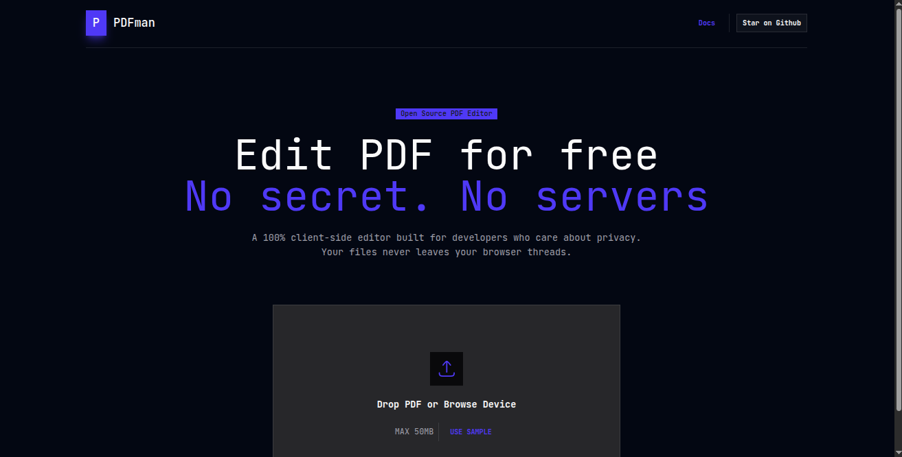

# Welcome to PDFman!

A modern, PDF document editor that allows you to edit, manipulate, and rearrange PDF documents.



## Features

- Add Text on top of the document
- Add signature
- Rearrange pages
- Add new page and delete pages

## Getting Started

### Installation

Install the dependencies:

```bash
npm install
```

### Development

Start the development server with HMR:

```bash
npm run dev
```

Your application will be available at `http://localhost:5173`.

## Building for Production

Create a production build:

```bash
npm run build
```

## Styling

This template comes with [Tailwind CSS](https://tailwindcss.com/) already configured for a simple default starting experience. You can use whatever CSS framework you prefer.

---

Built with ❤️ using React Router by [AzCodes](https://github.com/mumuniazeez).
